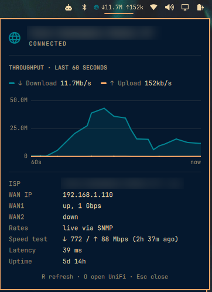

# UniFi WAN for Omarchy

An [Omarchy](https://omarchy.org) shell bar widget that shows your internet
connection as seen by a UniFi gateway (Dream Router, Dream Machine, Cloud
Gateway, …).



- **Bar:** a globe icon, green while an ISP link is up and red when every WAN
  is down, followed by live download/upload throughput (`↓412M ↑38M`).
- **Panel (left-click):** ISP name and state, a 60-second throughput graph,
  WAN IP, link speed of every WAN port, the last speed test result, latency
  and internet uptime.

| Input | Action |
| --- | --- |
| Left-click | Open / close the panel |
| Middle-click | Refresh now |
| Right-click | Open the UniFi Network dashboard |
| `R` / `O` / `Esc` in the panel | Refresh / open UniFi / close |

In a vertical (left/right) bar only the status icon is shown; rates are in
the tooltip and panel.

## Requirements

- Omarchy with the Quickshell-based shell (`omarchy-shell`)
- A UniFi OS gateway running UniFi Network 9.0 or newer (for API keys)
- `curl`, `jq`, `openssl` (installed on Omarchy by default)
- Recommended: a Secret Service keyring such as GNOME Keyring, plus
  `secret-tool` (package `libsecret`)
- Optional, for live throughput: `net-snmp` and SNMPv3 enabled on the gateway

## Install

```bash
omarchy plugin add https://github.com/djbarrios/unifi-wan-plugin --enable
```

Update later with `omarchy plugin update dbarrios.unifi-wan`.

## Setup

1. **Create an API key** in UniFi Network: *Settings → Control Plane →
   Integrations → Create API Key*.
2. **Store it in your keyring** (it prompts for the key without echoing it):

   ```bash
   secret-tool store --label='UniFi WAN' service unifi-wan
   ```

   Without a keyring, put it in a file only you can read instead:

   ```bash
   mkdir -p ~/.config/unifi-wan && chmod 700 ~/.config/unifi-wan
   (umask 077; read -rsp 'UniFi API key: ' k && echo && printf '%s\n' "$k" > ~/.config/unifi-wan/api-key)
   ```

3. That's it. The widget talks to your default gateway. If the UniFi gateway
   is not your default gateway, or you use a site other than `default`:

   ```bash
   echo 192.168.1.1 > ~/.config/unifi-wan/host
   echo mysite      > ~/.config/unifi-wan/site
   ```

### Live throughput with SNMPv3 (recommended)

The UniFi API's own throughput figures are only recalculated every 10–30
seconds, and the gateway has been seen to stop refreshing them for minutes at
a time while no UniFi dashboard was open. For live numbers, let the widget read the WAN
port's byte counters over SNMPv3, which the gateway updates every ~5 seconds:

1. In UniFi Network: *Settings → System → SNMP*, enable **SNMPv3** and set a
   username and password.
2. Install the SNMP tools: `omarchy pkg add net-snmp`
3. Save the username, and the password in your keyring:

   ```bash
   mkdir -p ~/.config/unifi-wan
   echo 'your-snmp-user' > ~/.config/unifi-wan/snmp-user
   secret-tool store --label='UniFi WAN SNMP' service unifi-wan-snmp
   ```

   Without a keyring, put the password in `~/.config/unifi-wan/snmp-password`
   (mode `0600`) instead.

The panel's *Rates* row shows `live via SNMP` once it works. The widget uses
SHA authentication with AES privacy, which is what UniFi gateways accept; to
use something else, write the protocol names to
`~/.config/unifi-wan/snmp-auth` and `~/.config/unifi-wan/snmp-priv`. If SNMP is
not set up or not reachable, the widget falls back to the API figures.

### Checking the setup

To check the setup from a terminal, run the data script directly:

```bash
~/.config/omarchy/plugins/dbarrios.unifi-wan/unifi-wan-status | jq
```

## Security

- The API key is read from the keyring (or a `0600` file) and handed to `curl`
  on stdin, so it never appears in the process list.
- UniFi gateways use self-signed certificates, so the widget pins the
  gateway's TLS public key on first contact (`~/.config/unifi-wan/pin`) and
  refuses to send the key anywhere that presents a different one.
- The key is only sent to private LAN IPv4 addresses; a public IP in the
  `host` setting is refused.
- SNMP uses v3 with authentication and encryption (`authPriv`). Its password
  is written to a private, per-run config file under `$XDG_RUNTIME_DIR` that
  is deleted afterwards, so it is never on a command line either.
- Give the key no more access than it needs, and revoke it in UniFi if it
  leaks.

If you replace the gateway or its certificate changes (some UniFi OS updates
do this), the widget reports that the TLS key changed. Re-pin with:

```bash
~/.config/omarchy/plugins/dbarrios.unifi-wan/unifi-wan-status --repin
```

## Notes

- With SNMP, rates are averaged over the counter updates of the last ~15
  seconds, so short bursts are smoothed rather than shown as spikes.
- Without SNMP, throughput comes from the gateway's API statistics, which can
  lag or freeze for minutes; see *Live throughput with SNMPv3* above.
- The widget polls every 5 seconds (2 while the panel is open); the graph
  plots only readings that changed.
- Rates are in bits per second: `k` = kbps, `M` = Mbps, `G` = Gbps.
- The speed test line appears once the gateway has a non-zero result; run a
  test from the UniFi dashboard to populate it.

## Files

| File | Purpose |
| --- | --- |
| `manifest.json` | Omarchy plugin manifest |
| `BarWidget.qml` | Bar button and panel |
| `Model.js` | Formatting and graph helpers |
| `unifi-wan-status` | Queries the gateway (API and SNMP) and prints one JSON line |
| `screenshot.png` | README screenshot |

## License

MIT
